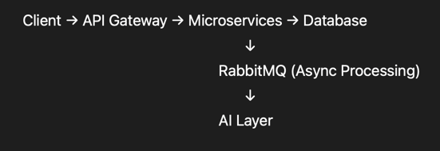

🚀 PayFlow — Production-Grade Fintech Backend System

🧩 Overview

PayFlow is a scalable, microservices-based fintech backend system that enables secure wallet management, transaction processing, and AI-powered financial insights.

⸻

🏗️ Architecture

⸻

⚙️ Features

•	🔐 JWT Authentication (centralized at API Gateway)

•	💰 Wallet system with ledger-based transactions

•	🔁 Idempotent APIs for safe retries

•	⚡ Redis caching for performance optimization

•	🚦 Rate limiting using token bucket algorithm

•	📩 Event-driven architecture using RabbitMQ

•	♻️ Retry + Dead Letter Queue for failure handling

•	🧠 AI-powered transaction categorization & insights

•	🐳 Fully Dockerized microservices setup

⸻

🛠 Tech Stack

•	Java, Spring Boot,Hibernate

•	Spring Cloud (Gateway, OpenFeign, Eureka)

•	MySQL

•	Redis

•	RabbitMQ

•	Docker & Docker Compose

⸻

🚀 Getting Started

1. Clone repo

   https://github.com/Divyanshu9151/PayFlow-System.git

   cd PayFlow-System

2. Run System

   docker-compose up --build

 📌 Key Learnings

   •	Built production-grade microservices architecture

   •	Implemented concurrency handling and idempotency

   •	Designed fault-tolerant distributed systems

   •	Integrated async messaging and caching layers

👨‍💻 Author

Divyanshu Anand  